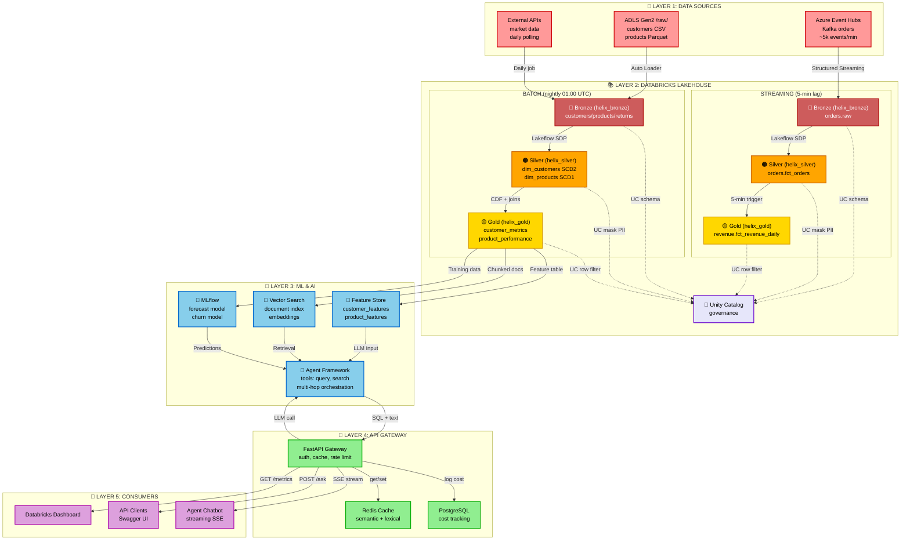

# ShopStream Databricks AI Platform — System Design

## Table of Contents

- [What Helix Is](#what-helix-is)
- [Business Problem](#business-problem)
- [High-Level Architecture](#high-level-architecture)
- [Data Flow — Batch & Streaming](#data-flow--batch--streaming-side-by-side)
- [Data Flow — AI Query](#data-flow--ai-query)
- [Layer Breakdown](#layer-breakdown)
  - [Layer 1: Data Sources](#layer-1-data-sources)
  - [Layer 2: Databricks Lakehouse](#layer-2-databricks-lakehouse)
  - [Layer 3: Mosaic AI Platform](#layer-3-mosaic-ai-platform)
  - [Layer 4: API Gateway](#layer-4-api-gateway)
  - [Layer 5: Consumers](#layer-5-consumers)
- [Technology Choices](#technology-choices)
- [Cost Architecture](#cost-architecture)
- [Security Architecture](#security-architecture)
- [Observability Architecture](#observability-architecture)

---

## What Helix Is

**ShopStream Databricks AI Platform** is a production-grade AI data platform that lets business teams ask natural-language questions about ShopStream's (fictional e-commerce) operational data. It answers using real-time and batch data processed through a Databricks Medallion architecture, served by a multi-tool AI agent.

> **DE parallel:** Helix is like a recommendation engine built on top of a data warehouse — but instead of recommending products, it answers business questions. The batch layer is your data warehouse. The real-time layer is your CDC feed. The AI agent is your query engine. MLflow is your job scheduler + model tracker.

---

## Business Problem

ShopStream has three business teams — Revenue, Customer, and Product — each asking questions like:

- "What was last week's revenue by region and product category?"
- "Which customer segments show the highest churn risk this month?"
- "Which products are trending and which are losing momentum?"

Currently: they write ad-hoc SQL, wait for the data team, or use static reports. With Helix: they ask in natural language via an API or a dashboard — and get a live, data-grounded answer in seconds.

---

## High-Level Architecture



---

## Data Flow — Batch & Streaming (side by side)

There are **two parallel data paths** that both feed Gold tables. They run independently and serve different latency requirements.

```
═══════════════════════════════════════════════════════════════════════
  STREAMING PATH (always-on, ~5 min lag)     BATCH PATH (nightly, 01:00 UTC)
═══════════════════════════════════════════════════════════════════════

  ShopStream checkout                        Lakeflow Connect (00:30–00:45 UTC)
  publishes OrderPlaced (JSON)               reads from PostgreSQL via JDBC
        │                                    → customers.raw, products.raw
        │ Kafka                              
        ▼                                    Auto Loader (23:30 UTC)
  Azure Event Hubs                           RMS drops returns CSV to ADLS Gen2
  helix-orders topic                         → returns.raw (cloudFiles)
        │                                           │
        │ Structured Streaming              Silver (01:00 UTC)
        │ (ingest_orders_streaming.py)         dim_customers  ← SCD2 (segment history)
        │ 10-min watermark                     dim_products   ← SCD1 (latest state)
        ▼                                       dim_regions    ← Truncate and Load
  1. Bronze: helix_bronze.orders.raw            fct_orders     ← Fact (streaming dedup)
        │                                       fct_returns    ← Fact (Auto Loader)
        │ Lakeflow SDP streaming pipeline            │
        │ (fct_orders.py)                            │ Gold pipeline (CDF read)
        │ @dlt.expect_or_drop rules                  │
        │ dedup by order_id                          ▼
        │                                   3. Gold (batch, ready 06:00 UTC):
        ▼                                       helix_gold.customers.fct_customer_metrics
  2. Silver: helix_silver.orders.fct_orders     helix_gold.products.fct_product_performance
        │                                       helix_gold.revenue.fct_revenue_daily (enriched)
        │ 5-min micro-batch trigger              helix_gold.ml.fct_forecast_features
        │ foreachBatch UPSERT (MERGE)
        │ (revenue_daily.py)
        ▼
  3. Gold (live, ~5 min lag):
     helix_gold.revenue.fct_revenue_daily
     updated throughout the day
                                                        │
═══════════════════════════════════════════════════════╪═══════════════
                                                        │
                                                 5. Feature Store refresh
                                                    customer_features fn
                                                    product_features fn
                                                        │
                                                 6. Lakehouse Monitoring
                                                    drift + volume alerts
                                                    on all Gold tables
═══════════════════════════════════════════════════════════════════════
```

**Key difference between the two paths:**

| | Streaming | Batch |
|---|---|---|
| Data | Orders only | Customers + Products |
| Trigger | Always-on (continuous) | Scheduled (01:00 UTC) |
| Latency | ~5 minutes | Ready by 06:00 UTC |
| Write mode | MERGE (UPSERT daily totals) | Overwrite / CDF incremental |
| Job file | `streaming_pipeline.yml` | `nightly_batch_pipeline.yml` |

`fct_revenue_daily` is the **only Gold table touched by both paths**: the streaming job writes raw daily totals continuously, and the nightly batch job enriches those totals with customer segment + product brand data.

---

## Data Flow — AI Query

```
Business user sends:
POST /v1/ask  {"question": "Which product categories had declining revenue last 30 days?"}
   │
FastAPI (api_gateway/src/routes/ask.py)
   ├── Validates request (Pydantic v2)
   ├── Authenticates via Azure Managed Identity
   └── Calls Mosaic AI Agent Framework
          │
          ▼
Agent Orchestrator (ai_platform/agents/orchestrator.py)
   ├── Parses question → determines needed tools
   ├── Step 1: query_metrics tool
   │   ├── text_to_sql: Llama 3.3 generates SQL against helix_gold schema
   │   ├── SQL validates against Unity Catalog schema (no injection risk)
   │   └── Executes on SQL Serverless Warehouse → returns DataFrame
   ├── Step 2: search_documents tool (if business context needed)
   │   └── Vector Search on business_docs_index → retrieves relevant report excerpts
   └── Step 3: synthesize_answer
       ├── Constructs prompt: question + SQL result + document context
       ├── Calls Foundation Model API (Llama 3.3 70B) via Unity AI Gateway
       │   └── Unity AI Gateway: rate limit check + audit log + route to model
       └── Returns structured answer (Pydantic model)
          │
          ▼
FastAPI streams response back to client (SSE)
```

> **🚚 Courier analogy:** The agent is a depot dispatcher — it receives a shipping request (question), decides which couriers (tools) to deploy, collects the parcels (data), and writes the final shipping manifest (answer) using the LLM as its writing desk.

---

## Layer Breakdown

### Layer 1: Data Sources

| Source | Type | Data | Connector |
|---|---|---|---|
| Azure Event Hubs | Real-time | Order events (JSON) | Kafka endpoint → Structured Streaming |
| ADLS Gen2 `/raw/customers/` | Batch | Customer master data (CSV) | Auto Loader `cloudFiles` |
| ADLS Gen2 `/raw/products/` | Batch | Product catalog (Parquet) | Auto Loader `cloudFiles` |
| External market API | Batch | Competitor pricing (REST) | httpx polling job in Lakeflow Jobs |

> **DE parallel:** Event Hubs = Kafka. ADLS Gen2 = S3. Auto Loader = S3 Event Notifications + trigger.

### Layer 2: Databricks Lakehouse

**Bronze** — raw ingestion, no transformations:
- Append-only Delta tables
- Schema enforcement via `cloudFiles.schemaHints` (Auto Loader) or Lakeflow Connect CDC
- Partitioned by `ingestion_date`
- Unity Catalog: `helix_bronze.{domain}.{table}`

**Silver** — cleaned, validated, and modelled:

| Table | Naming prefix | Strategy | Why |
|---|---|---|---|
| `customers.dim_customers` | `dim_` | SCD Type 2 | Track segment/region changes for point-in-time ML joins |
| `products.dim_products` | `dim_` | SCD Type 1 | Only current product state needed |
| `regions.dim_regions` | `dim_` | Truncate and load | 10 rows from a CSV — rebuild nightly, no history needed |
| `product_categories.dim_product_categories` | `dim_` | Truncate and load | 22 rows from a CSV — same as regions |
| `orders.fct_orders` | `fct_` | Fact / dedup | Events are immutable — append-only |
| `returns.fct_returns` | `fct_` | Fact / dedup | Events are immutable — append-only |

**Gold** — aggregated and business-ready:
- Fact tables (`fct_`) hold aggregated event metrics; dimension tables (`dim_`) hold enrichment lookups
- Read via Change Data Feed from Silver (incremental, not full reload)
- Optimised with Z-ORDER on most-queried columns
- Lakehouse Monitoring enabled on every Gold table
- Unity Catalog: `helix_gold.{domain}.{table}`

### Layer 3: Mosaic AI Platform

| Component | What it does | DE parallel |
|---|---|---|
| MLflow | Tracks every training run — params, metrics, model artifact | Like a git history for model training runs |
| Feature Store | Versioned customer + product features, used by both models and RAG | Like a shared lookup table that's always fresh |
| Model Serving | Hosts forecasting + churn models as REST endpoints | Like a Lambda function that runs your model |
| Vector Search | Serverless vector index on Gold tables + business PDFs | Like an Elasticsearch index, but for semantic similarity |
| Foundation Model APIs | Llama 3.3 70B pay-per-token — no deployment config | Like calling an external API, billed per request |
| Agent Framework | Multi-step orchestrator that routes across 6 tools | Like a workflow engine (Airflow) but for LLM reasoning steps |
| Unity AI Gateway | Rate limits, audit logs, model routing | Like an API gateway in front of all LLM calls |
| AI/BI Genie | Native NL-to-SQL space in Databricks workspace | Like Databricks SQL but you type English |
| Lakehouse Monitoring | Drift + volume + quality alerts on Gold tables | Like dbt tests that run daily on your warehouse |

### Layer 4: API Gateway

**FastAPI on Azure Container Apps:**
- Scales to zero when idle — no idle cost
- Azure Managed Identity: no client secrets stored in the app
- All Databricks calls via async httpx — non-blocking
- Pydantic v2 validates all inputs and parses all LLM outputs into typed models
- Sentry for error tracking in production

### Layer 5: Consumers

| Consumer | Interface | Primary use |
|---|---|---|
| Revenue team | REST API (`/v1/ask`, `/v1/metrics`) | Ad-hoc questions, programmatic dashboards |
| Customer team | Power BI → SQL Warehouse | Scheduled reports, churn dashboard |
| Product team | Databricks App (Streamlit) | Interactive product performance explorer |

---

## Technology Choices

| Decision | Choice | Why not the alternative |
|---|---|---|
| Pipeline framework | Lakeflow Spark Declarative Pipelines | Simpler than raw Spark jobs; built-in data quality, lineage, auto-retry |
| Vector store | Mosaic AI Vector Search (serverless) | No infrastructure to manage; indexes directly on Delta tables; €0 when idle |
| LLM | Foundation Model APIs (Llama 3.3 70B) | Pay-per-token, no deployment config; not Azure OpenAI to keep everything inside Databricks |
| ML tracking | MLflow (native Databricks) | Already in workspace; no separate server to manage |
| ML serialisation | PyFunc | Packages business logic + model in one deployable unit |
| API framework | FastAPI | Async, Pydantic v2 native, widely understood |
| Container hosting | Azure Container Apps | Scales to zero; no Kubernetes to manage |
| Secrets | Azure Key Vault + Databricks secret scope | Zero hardcoded credentials anywhere |
| IaC | Terraform (azurerm) + Databricks Asset Bundles | Industry standard; DAB handles Databricks-native resources |

---

## Cost Architecture

| Component | Billing model | Estimated monthly (normal use) |
|---|---|---|
| Databricks Lakeflow Jobs (serverless) | DBU/hour (~€0.07/DBU) | €10–20 |
| Databricks SQL Warehouse (serverless) | DBU/hour, scales to zero | €5–10 |
| Mosaic AI Vector Search (serverless) | Per query + storage | €2–5 |
| Foundation Model API (Llama 3.3 70B) | Per 1k tokens (~€0.001) | €2–5 |
| Model Serving endpoints | DBU/hour, scales to zero | €5–10 |
| Azure Event Hubs (Basic tier) | Per million events | €1–2 |
| ADLS Gen2 | Per GB stored + transactions | €2–5 |
| Azure Container Apps | Per vCPU-second (scales to zero) | €1–3 |
| Azure Key Vault | Per 10k operations | <€1 |
| **Total estimated** | | **€28–60/month** |

**Hard guardrails:**
- Azure Cost Management alert at €50/month
- All clusters: `autotermination_minutes = 30`
- SQL Warehouse auto-stop: 10 minutes
- `scripts/teardown.sh` destroys all resources after lab sessions

---

## Security Architecture

```
Internet
   │
   ▼
Azure Container Apps (API Gateway)
   │ Azure Managed Identity (no stored credentials)
   ▼
Azure Key Vault ←── all secrets stored here
   │ Databricks secret scope backed by Key Vault
   ▼
Databricks Workspace (VNet-injected)
   │
   ├── Unity Catalog
   │   ├── Column masking: customer_email, first_name (masked for non-owners)
   │   └── Row filters: team-scoped access to product/customer segments
   │
   └── Unity AI Gateway
       ├── Rate limits: 200 LLM requests/day per API key
       ├── Audit logs: every LLM call logged with user, prompt hash, latency
       └── Guardrails: blocks off-topic / harmful queries at gateway level

ADLS Gen2 ←── Private Endpoint (no public internet access)
Event Hubs ←── Private Endpoint
```

**No credentials in code, ever.** Azure Managed Identity handles Container Apps → Key Vault. Databricks secret scope handles workspace → Key Vault. Terraform variables handle CI → Azure.

---

## Observability Architecture

| Signal | Tool | What it tells you |
|---|---|---|
| Pipeline logs | loguru → Azure Log Analytics | Which jobs ran, how long, how many rows |
| Data quality | Lakehouse Monitoring | Row counts, null rates, schema drift on Gold tables |
| Model quality | MLflow Evaluate | RMSE/AUC per training run, LLM answer quality per eval run |
| API errors | Sentry | Stack traces, error rates, p95 latency |
| Azure infra | Azure Monitor | Container App restarts, Event Hubs throughput, ADLS latency |
| LLM usage | Unity AI Gateway audit logs | Token counts, latency, model version, who asked what |
| Cost | Databricks system tables (`system.billing.usage`) | DBU usage per job/user/team — chargeback ready |
